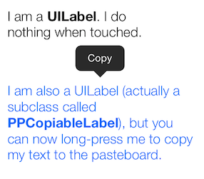
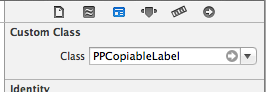

PPCopiableLabel
===============

A simple subclass of UILabel that allows users to copy text with a long press. Handles highlighting the label as needed.

PPCopiableLabel can be used as a drop-in replacement for UILabel. You can simply change the custom class of any UILabel in Interface Builder, and that label will have the ability to display the Copy menu when pressed for a second.

## Installation

Install via [Cocoapods](http://cocoapods.org/). Here's a sample `Podfile`:

    pod 'PPCopiableLabel'

Alternatively, just drop the two files (`PPCopiableLabel.m` and `PPCopiableLabel.h`) into your project tree.

## Contact

Vikram Kriplaney

- http://github.com/markiv
- http://twitter.com/krips
- vikram@local.ch | vikram@iphonso.com

## License

PPCopiableLabel is available under the MIT license. See the LICENSE file for more info.
